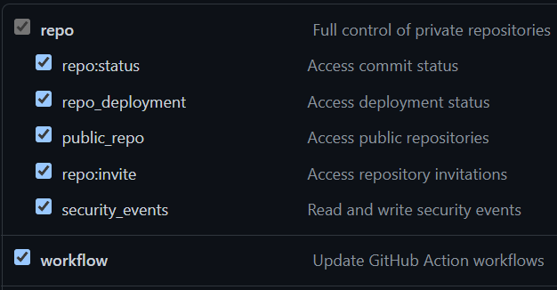
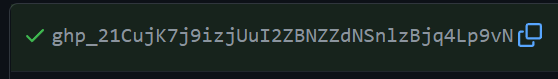
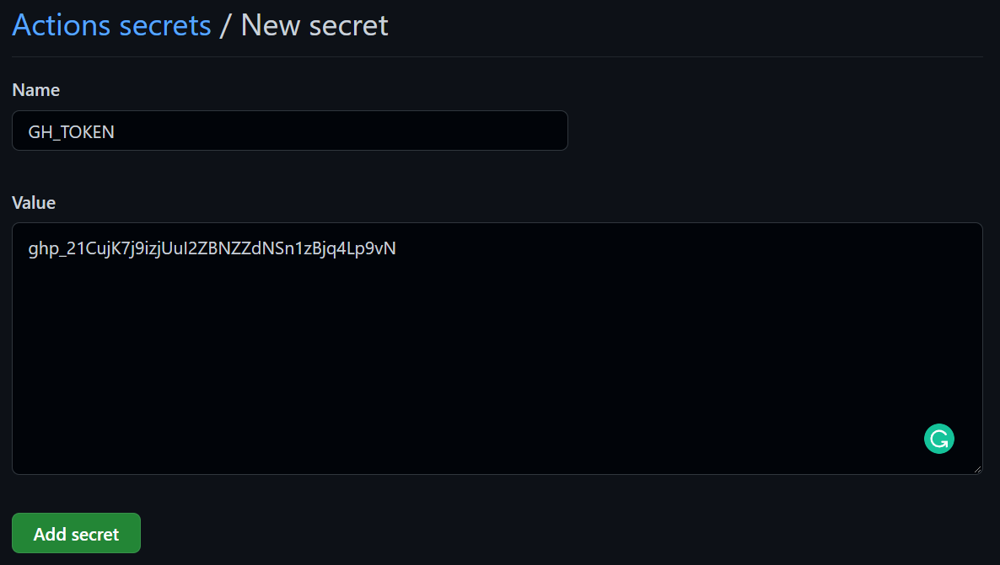
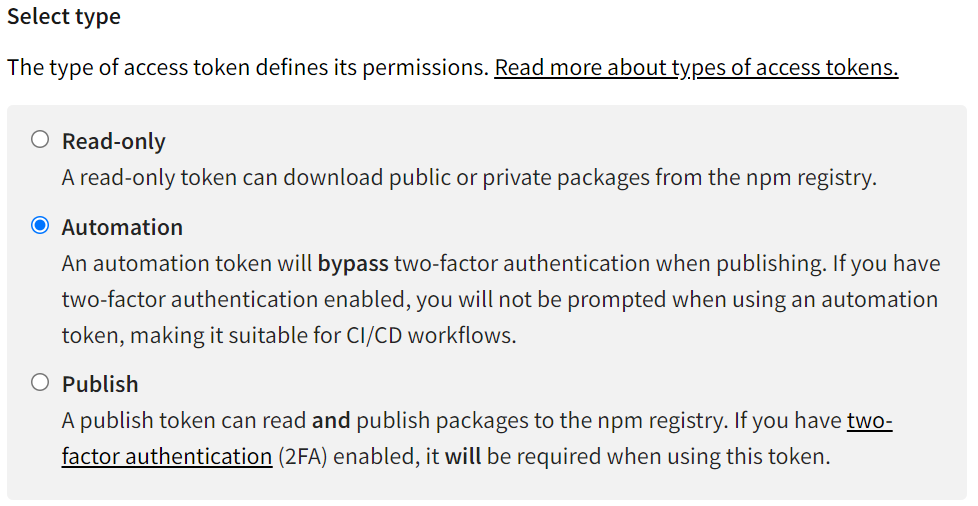
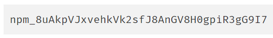
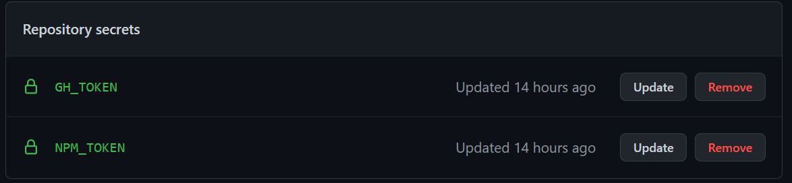
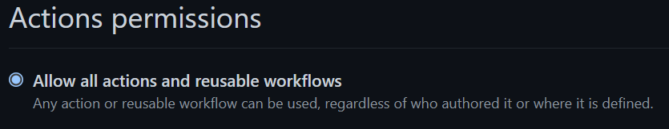
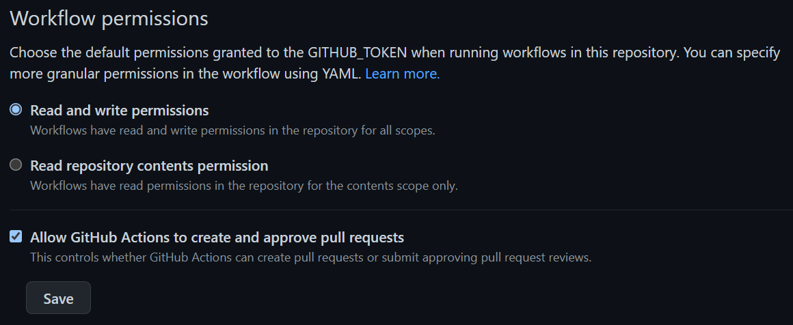

# Installation Instructions

<!-- Note: The toc tags mark autogenerated content. Do not manually modify the content here -->

<!-- toc -->

-   [1. Install the Package](#1-install-the-package)
-   [2. Configure Your Package's Release Script](#2-configure-your-packages-release-script)
-   [3. Create a Publishing Script](#3-create-a-publishing-script)
-   [4. Create a Github Personal Access Token](#4-create-a-github-personal-access-token)
-   [5. Create an NPM Access Token](#5-create-an-npm-access-token)
-   [6. Grant Repository Action Permissions](#6-grant-repository-action-permissions)

<!-- tocstop -->

---

## 1. Install the Package

```bash
$ npm install --save-dev semantic-release @m-scott-lassiter/semantic-release-github-npm-config
```

---

## 2. Configure Your Package's Release Script

The shareable config can be configured in one of [three ways](https://github.com/semantic-release/semantic-release):

<details open="open">
    <summary><b>A key in package.json</b></summary>

```json
{
    "name": "my-package-name",
    ...
    "release": {
        "extends": "@m-scott-lassiter/semantic-release-github-npm-config"
    }
}
```

</details>

<details>
    <summary><b>In a <code>.releaserc</code> File</b></summary>

```json
{
    "extends": "@m-scott-lassiter/semantic-release-github-npm-config"
}
```

</details>

<details>
    <summary><b>In a <code>release.config.js</code> File</b></summary>

```javascript
module.exports = {
    extends: '@m-scott-lassiter/semantic-release-github-npm-config'
}
```

</details>

---

## 3. Create a Publishing Script

In your project root directory, create a folder called `.github`, then inside create another folder called `workflows`. There, you will create a publishing script. See [this repository's own script](https://github.com/M-Scott-Lassiter/semantic-release-github-npm-config/blob/main/.github/workflows/publish.yml) for an example.

In this script, any pushes to the `main` or `beta` branches will trigger `semantic-release`. However, it will fail because it does not yet have the appropriate permissions.

---

## 4. Create a Github Personal Access Token

This token allows the automation tools to make changes to your repository. [Create a token](https://docs.github.com/en/authentication/keeping-your-account-and-data-secure/creating-a-personal-access-token) with "repo" and "workflow"permissions:



This will generate a token value:



**Note: This token was created as an example and immediately deleted. You MUST keep this value a secret. Github will not show you this value again. If you lose it, you will need to generate a new token.**

Return to project. In the repository settings, navigate to Secrets > Actions. Create a new repository secret, and name it `GH_TOKEN`, and paste the copied token value:



---

## 5. Create an NPM Access Token

This token allows the automation tools to publish the package to NPM. [Create a token](https://docs.npmjs.com/creating-and-viewing-access-tokens) with automation privleges



This will generate a token value:



**Note: Like the Github PAT above, this token was created as an example and immediately deleted. You MUST keep this value a secret. NPM will not show you this value again. If you lose it, you will need to generate a new token.**

Return to project. As you did before, create a new repository secret, name it `NPM_TOKEN`, and paste the copied token value. You now have both required tokens:



---

## 6. Grant Repository Action Permissions

`semantic-release` now has all the secrets it needs, but you still have to grant Github Actions permission to modify the repository. Go to the repository's Settings > Actions > General.

Allow all actions and reusable workflows:



Then set the workflow permissions:



---

Your repository is now configured to run `semantic-release`. Return to the [README](/../../blob/main/CONTRIBUTING.md) for commit guidance and release triggers.
